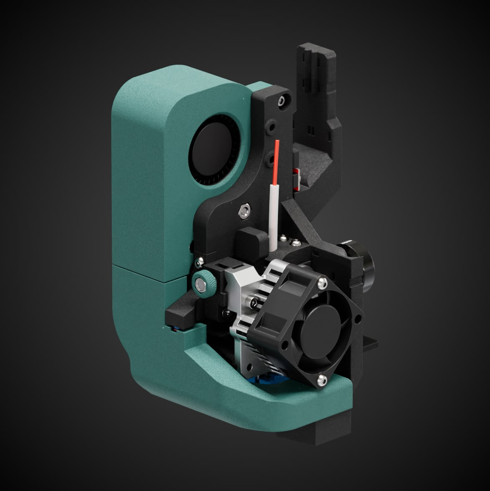

#Мои проекты
<table>
  <tbody>
    <tr>
      <td width=300 style="vertical-align: middle"></td>
      <td style="vertical-align: middle; font-size: 1.2em"><b>Titanator AeroLight</b> - это открытый проект печатной головы для Creality Ender 3.
        <ul>
          <li>Функциональная</li>
          <li>Качественный обдув на 2-х 5015 вентиляторах</li>
          <li>Встроенный ABL сенсор</li>
          <li>Низкая масса</li>
        </ul>
<a href="https://t.me/ft_aerolight">Telegram канал проекта</a>
</td>
    </tr>
  </tbody>
</table>
